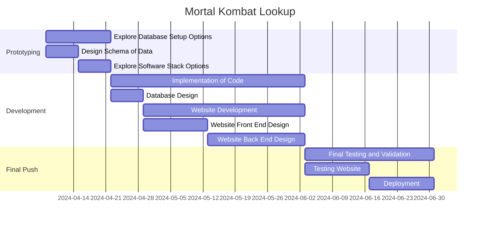

# Mortal Kombat Lookup

### Contributors: Victoria Asencio-Clemens, Isaac Lake, and Ethan Vosburg

## Table of Contents
- **[Introduction](#introduction)**<be>
- **[Goals](#goals)** 
- **[Project Planning](#project-planning)** 

## External Links
- **[Customer Stories](main/docs/user_stories.md)**

## Introduction

For the group project, we will be building the back-end database for a popular video game, Mortal Kombat! For each player, we will track characters unlocked and xp. The read-and-write operations come into play when leveling up or selecting characters 
to equip.

The goal is to make a way to interface with a database to retrieve certain data about all of the different characters in the game. We would also like to add ways to compare characters and see if one might be better in certain circumstances. It would also be interesting to experiment with AI-driven features that would give us insight into how to interpret the information or clue us into how to act on it. 

> [!NOTE]
> **Mortal Kombat** is a street figher-like game that puts two players against each other with different characters that have different traits. The two players fight each other until one remains using different skills and abilities to defeat the opponent. 

## Goals
- Primary Goals
  - Store stats on characters in the game
  - Compare different characters
  - Section and filter characters
- Stretch Goals
  - Add AI analysis
  - add a front-end interaction element

## Project Planning

