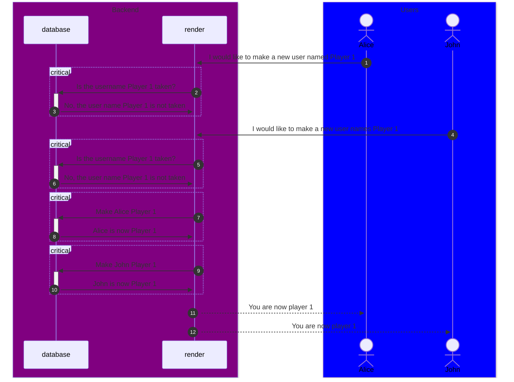
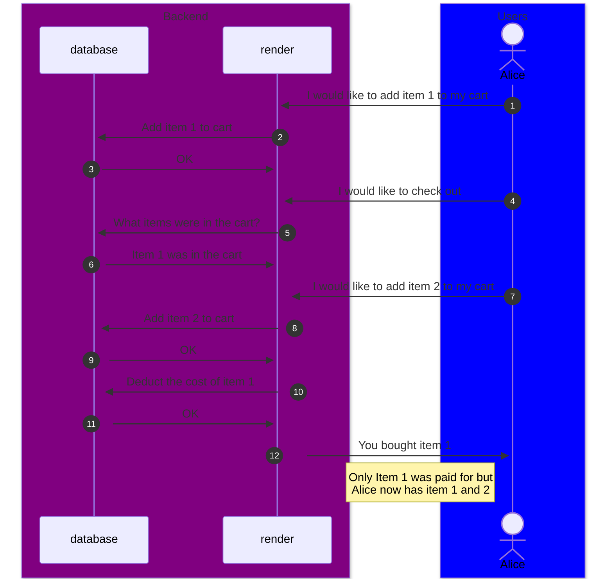

# Possible concurrency issues

## 1 Double User Creation

### Potential Problem

It would be possible to issue multiple requests in a way that would create duplicate usernames in the database. This phenomenon would be called a dirty read. Because our project is assuming that every username is unique, this could lead to problems when referencing users by usernames. You could have instances where one, multiple, or none of the users are referenced which would lead to game breaking problems.

### Potential Solution

A solution to this is to change the isolation level to `read committed` this would prevent dirty reads from happening altogether in the database, however, it is preferable to instead change the code to be more robust. In this case, there should be no check for a unique username but instead give ever user a unique user ID on the backend and allow any user to have any username that they want and then only refer to users by their UUID. 

## 2 Adding an Item While Checking Out

### Potential Problem

If a user were to try and add an item to the cart, while they were checking out, they could potentially be able to get items they did not pay for by sending request while the total is being calculated. 

### Potential Solution

This could be solved by putting a lock on the cart so that it cannot be modified after the checkout process has begun. This would mean that subsequent requests to add items to the cart would be negated and the total cost of the items could be calculated successfully. 

