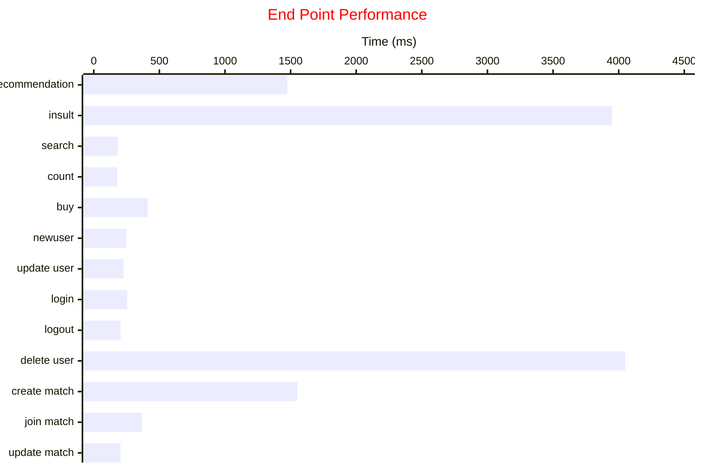
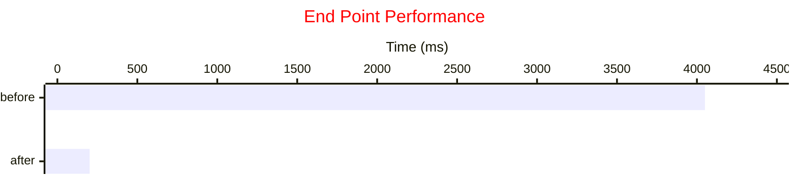
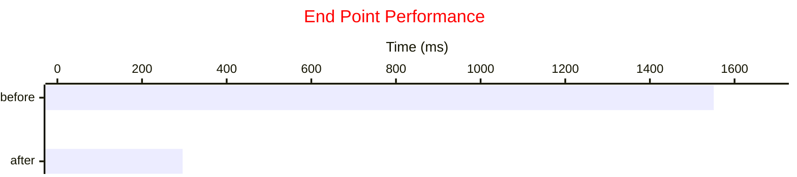
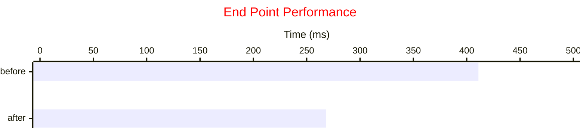

# Scaling the Database

In order to properly test the database performance at scale, there needs to be much more data in the database so that we can simulate a real world load on the database. This was achieved by adding millions of rows to the characters, users, matches, and gold ledger tables. 

> [!NOTE]
> Python script used to make fake data located [here](https://github.com/EthanV1920/CSC365-DatabasesGroupProject/blob/2a7545955b9715c7d1c5b38348ee4a511d01b6f5/fake_data_gen/fake_char.py#L1)

Using the above method, we genetated a couple million rows of data to test the performance of our database.

<div align="center">
    
|Table Name | Rows Added|
|--------:|---|
|characters | 11 million|
|users | 1 million|
|matches | 2.2 million|
|gold_ledger | 1 million|

</div>

    

# Performance Results

After expanding the database, baseline measurements needed to be taken to show us what needs to be improved and what doesn't need much help. With the newly expanded database we found the most endpoints competed in a reasonable amount of time, but there were a few that became outliers.


<div align="center">

|Endpoint | Time (ms)|
|----------:|---------|
|Recommendation| 1475|
|Insult| 3950|
|Search| 183|
|Character Count| 179|
|Purchase Character| 411|
|New User| 248|
|Update User| 227|
|Login User| 255 |
|Logout User| 205|
|Delete User| 4050|
|Create Match| 1551|
|Join Match| 365|
|Update Match| 202|

</div>

After taking all the data, it became apparent that there were some key points that we needed to improve on. The Recommendation and Insult endpoints took long because they were making requests to OpenAI, therefore we cannot improve their performance through indexing. Instead, we chose to improve the performance of the three slowest endpoints that rely on SQL queries:
1. Delete User
2. Create Match
3. Purchase Character

# Performance Tuning

With the 3 slowest endpoints chosen we can now look into what is making each of them slow and then begin to speed up the queries with indices. 

## 1 Deleting Users

By far, the slowest endpoint was the `deleteUser` endpoint which started around 4 seconds, the first step to speeding up this endpoint was to run and explain analyze and see where the problem is coming from

```sql
explain analyze
DELETE FROM users WHERE user_id = <arbitrary user>
```

Upon completing this command, we got this query plan back:

<center>

| QUERY PLAN                                                                                                             |
| ---------------------------------------------------------------------------------------------------------------------- |
| Delete on users  (cost=0.42..2.64 rows=0 width=0) (actual time=0.131..0.131 rows=0 loops=1)                            |
|   ->  Index Scan using users_pkey on users  (cost=0.42..2.64 rows=1 width=6) (actual time=0.048..0.048 rows=1 loops=1) |
|         Index Cond: (user_id = 1001143)                                                                                |
| Planning Time: 0.362 ms                                                                                                |
| Trigger for constraint gold_ledger_user_id_fkey: time=323.069 calls=1                                                  |
| Trigger for constraint characters_ledger_user_id_fkey: time=3399.698 calls=1                                           |
| Execution Time: 3723.722 ms                                                                                            |

</center>

Looking at this query plan, we see that there are two triggers for the constraint `gold_ledger_user_id_fkey` and `characters_ledger_user_id_fkey` associated with these two triggers is the time that that operation added to the execution plan. With this information, an index should be made on both of these attributes to help with look up time.

```sql
create index user_id_index on characters_ledger(user_id)
create index ledger_user_id_index on gold_ledger(user_id)
```

| QUERY PLAN                                                                                                             |
| ---------------------------------------------------------------------------------------------------------------------- |
| Delete on users  (cost=0.42..2.64 rows=0 width=0) (actual time=0.123..0.123 rows=0 loops=1)                            |
|   ->  Index Scan using users_pkey on users  (cost=0.42..2.64 rows=1 width=6) (actual time=0.042..0.042 rows=1 loops=1) |
|         Index Cond: (user_id = 1001147)                                                                                |
| Planning Time: 0.371 ms                                                                                                |
| Trigger for constraint gold_ledger_user_id_fkey: time=0.410 calls=1                                                    |
| Trigger for constraint characters_ledger_user_id_fkey: time=0.262 calls=1                                              |
| Execution Time: 0.904 ms                                                                                               | 


After successfully creating these indices, we then performance tested again, but this time got much better results. We saw 4050ms go down to 202ms.



Adding the indices in this case proved to be beneficial as we were able to shave seconds off of the query time.

## 2 Create Match
```sql
explain
with user_level as (select level
        from users
        where user_id = :user_id),
     opponent
     as (select nullif(user_id, (select player2 from matches where player2 = :user_id and player2_char is null)) as user_id
             from users,
             user_level
             where users.level between user_level.level - 5 and user_level.level + 5
             and user_id != :user_id
             and (select online
                 from users
                 where user_id = :user_id) = true
             and online = true
             order by random()
             limit 1)
    insert into
matches (
        player1,
        player1_char,
        player2,
        player2_char,
        status
        )
    values
    (
     :user_id,
     :user_char,
     (
      select
      *
      from
      opponent
     ),
     null,
     -1
    )
    returning
    id,
    player2;
```

| QUERY PLAN                                                                                                                   |
| ---------------------------------------------------------------------------------------------------------------------------- |
| Insert on matches  (cost=71139.32..71139.34 rows=1 width=48)                                                                 |
|   CTE opponent                                                                                                               |
|     ->  Limit  (cost=71139.30..71139.30 rows=1 width=12)                                                                     |
|           InitPlan 1 (returns $0)                                                                                            |
|             ->  Seq Scan on matches matches_1  (cost=0.00..49574.98 rows=1 width=8)                                          |
|                   Filter: ((player2_char IS NULL) AND (player2 = 12345))                                                     |
|           InitPlan 2 (returns $1)                                                                                            |
|             ->  Index Scan using user_id_index on users  (cost=0.42..2.64 rows=1 width=1)                                    |
|                   Index Cond: (user_id = 123456)                                                                             |
|           ->  Sort  (cost=21561.68..21561.68 rows=1 width=12)                                                                |
|                 Sort Key: (random())                                                                                         |
|                 ->  Result  (cost=0.42..21561.67 rows=1 width=12)                                                            |
|                       One-Time Filter: $1                                                                                    |
|                       ->  Nested Loop  (cost=0.42..21561.66 rows=1 width=4)                                                  |
|                             Join Filter: ((users_1.level >= (users_2.level - 5)) AND (users_1.level <= (users_2.level + 5))) |
|                             ->  Seq Scan on users users_1  (cost=0.00..21559.00 rows=1 width=8)                              |
|                                   Filter: (online AND (user_id <> 123456))                                                   |
|                             ->  Index Scan using user_id_index on users users_2  (cost=0.42..2.64 rows=1 width=4)            |
|                                   Index Cond: (user_id = 123456)                                                             |
|   InitPlan 4 (returns $3)                                                                                                    |
|     ->  CTE Scan on opponent  (cost=0.00..0.02 rows=1 width=4)                                                               |
|   ->  Result  (cost=0.00..0.02 rows=1 width=48)                                                                              

    Based off the above query plan, we decided to index the player1 and player2 in matches as well as online in users

```sql
create index player1_index ON matches (player1)
create index player2_index ON matches (player2)
create index online_index ON users (online)
```

| QUERY PLAN                                                                                                                        |
| --------------------------------------------------------------------------------------------------------------------------------- |
| Insert on matches  (cost=12.89..12.91 rows=1 width=48) (actual time=2.205..2.208 rows=1 loops=1)                                  |
|   CTE opponent                                                                                                                    |
|     ->  Limit  (cost=12.86..12.87 rows=1 width=12) (actual time=0.060..0.061 rows=0 loops=1)                                      |
|           InitPlan 1 (returns $0)                                                                                                 |
|             ->  Index Scan using player2_index on matches matches_1  (cost=0.43..6.00 rows=1 width=8) (never executed)            |
|                   Index Cond: (player2 = 12345)                                                                                   |
|                   Filter: (player2_char IS NULL)                                                                                  |
|           InitPlan 2 (returns $1)                                                                                                 |
|             ->  Index Scan using users_pkey on users  (cost=0.42..2.64 rows=1 width=1) (actual time=0.036..0.037 rows=1 loops=1)  |
|                   Index Cond: (user_id = 123456)                                                                                  |
|           ->  Sort  (cost=4.22..4.23 rows=1 width=12) (actual time=0.059..0.059 rows=0 loops=1)                                   |
|                 Sort Key: (random())                                                                                              |
|                 Sort Method: quicksort  Memory: 25kB                                                                              |
|                 ->  Result  (cost=0.85..4.21 rows=1 width=12) (actual time=0.039..0.039 rows=0 loops=1)                           |
|                       One-Time Filter: $1                                                                                         |
|                       ->  Nested Loop  (cost=0.85..4.21 rows=1 width=4) (never executed)                                          |
|                             Join Filter: ((users_1.level >= (users_2.level - 5)) AND (users_1.level <= (users_2.level + 5)))      |
|                             ->  Index Scan using online_index on users users_1  (cost=0.42..1.55 rows=1 width=8) (never executed) |
|                                   Index Cond: (online = true)                                                                     |
|                                   Filter: (user_id <> 123456)                                                                     |
|                             ->  Index Scan using users_pkey on users users_2  (cost=0.42..2.64 rows=1 width=4) (never executed)   |
|                                   Index Cond: (user_id = 123456)                                                                  |
|   InitPlan 4 (returns $3)                                                                                                         |
|     ->  CTE Scan on opponent  (cost=0.00..0.02 rows=1 width=4) (actual time=0.061..0.061 rows=0 loops=1)                          |
|   ->  Result  (cost=0.00..0.02 rows=1 width=48) (actual time=0.699..0.700 rows=1 loops=1)                                         |
| Planning Time: 3.828 ms                                                                                                           |
| Execution Time: 2.345 ms   

After successfully creating these indices, we then performance tested again, but this time got much better results. We saw 1551ms go down to 296ms.




## 3 Purchase Character

```sql
explain
  SELECT users.user_id, characters.character_id, COALESCE(SUM(gold_ledger.gold), 0)
  FROM users
  LEFT JOIN characters ON characters.name = 'Jade'
  LEFT JOIN gold_ledger ON users.user_id = gold_ledger.user_id
  WHERE users.username = 'Victoria'
  GROUP BY users.user_id, characters.character_id
```

| QUERY PLAN                                                                                                                                        |
| ------------------------------------------------------------------------------------------------------------------------------------------------- |
| GroupAggregate  (cost=10.56..10.60 rows=2 width=16) (actual time=0.085..0.086 rows=1 loops=1)                                                     |
|   Group Key: users.user_id, characters.character_id                                                                                               |
|   ->  Sort  (cost=10.56..10.57 rows=2 width=12) (actual time=0.080..0.081 rows=4 loops=1)                                                         |
|         Sort Key: users.user_id, characters.character_id                                                                                          |
|         Sort Method: quicksort  Memory: 25kB                                                                                                      |
|         ->  Nested Loop Left Join  (cost=0.85..10.55 rows=2 width=12) (actual time=0.049..0.056 rows=4 loops=1)                                   |
|               ->  Nested Loop Left Join  (cost=0.85..9.06 rows=2 width=8) (actual time=0.032..0.036 rows=4 loops=1)                               |
|                     ->  Index Scan using users_full_name_idx on users  (cost=0.42..3.76 rows=2 width=4) (actual time=0.023..0.023 rows=1 loops=1) |
|                           Index Cond: (username = 'Ethan'::text)                                                                                  |
|                     ->  Index Scan using gold_id_index on gold_ledger  (cost=0.42..2.64 rows=1 width=8) (actual time=0.007..0.010 rows=4 loops=1) |
|                           Index Cond: (user_id = users.user_id)                                                                                   |
|               ->  Materialize  (cost=0.00..1.47 rows=1 width=4) (actual time=0.004..0.004 rows=1 loops=4)                                         |
|                     ->  Seq Scan on characters  (cost=0.00..1.46 rows=1 width=4) (actual time=0.012..0.014 rows=1 loops=1)                        |
|                           Filter: (name = 'Jade'::text)                                                                                           |
|                           Rows Removed by Filter: 36                                                                                              |
| Planning Time: 1.835 ms                                                                                                                           |
| Execution Time: 0.182 ms                                                                                                                          |

Based off the above query plan, we decided to index the user_id in gold_ledger to avoid that sequential search. The other sequential search in the query plan is on the characters table, but we chose not to index this because the tablewill always be only 30 rows long and indexing would not create a significant change in performance:

```sql
create index gold_user_index ON gold_ledger (user_id)
```

| QUERY PLAN                                                                                                                                          |
| --------------------------------------------------------------------------------------------------------------------------------------------------- |
| GroupAggregate  (cost=10.56..10.60 rows=2 width=16) (actual time=0.094..0.095 rows=1 loops=1)                                                       |
|   Group Key: users.user_id, characters.character_id                                                                                                 |
|   ->  Sort  (cost=10.56..10.57 rows=2 width=12) (actual time=0.088..0.090 rows=4 loops=1)                                                           |
|         Sort Key: users.user_id, characters.character_id                                                                                            |
|         Sort Method: quicksort  Memory: 25kB                                                                                                        |
|         ->  Nested Loop Left Join  (cost=0.85..10.55 rows=2 width=12) (actual time=0.057..0.065 rows=4 loops=1)                                     |
|               ->  Nested Loop Left Join  (cost=0.85..9.06 rows=2 width=8) (actual time=0.040..0.044 rows=4 loops=1)                                 |
|                     ->  Index Scan using users_full_name_idx on users  (cost=0.42..3.76 rows=2 width=4) (actual time=0.026..0.026 rows=1 loops=1)   |
|                           Index Cond: (username = 'Ethan'::text)                                                                                    |
|                     ->  Index Scan using gold_user_index on gold_ledger  (cost=0.42..2.64 rows=1 width=8) (actual time=0.011..0.014 rows=4 loops=1) |
|                           Index Cond: (user_id = users.user_id)                                                                                     |
|               ->  Materialize  (cost=0.00..1.47 rows=1 width=4) (actual time=0.004..0.005 rows=1 loops=4)                                           |
|                     ->  Seq Scan on characters  (cost=0.00..1.46 rows=1 width=4) (actual time=0.012..0.014 rows=1 loops=1)                          |
|                           Filter: (name = 'Jade'::text)                                                                                             |
|                           Rows Removed by Filter: 36                                                                                                |
| Planning Time: 1.020 ms                                                                                                                             |
| Execution Time: 0.198 ms                                                                                                                            |

After successfully creating these indices, we then performance tested again, but this time got better results. We saw 411ms go down to 268ms.



